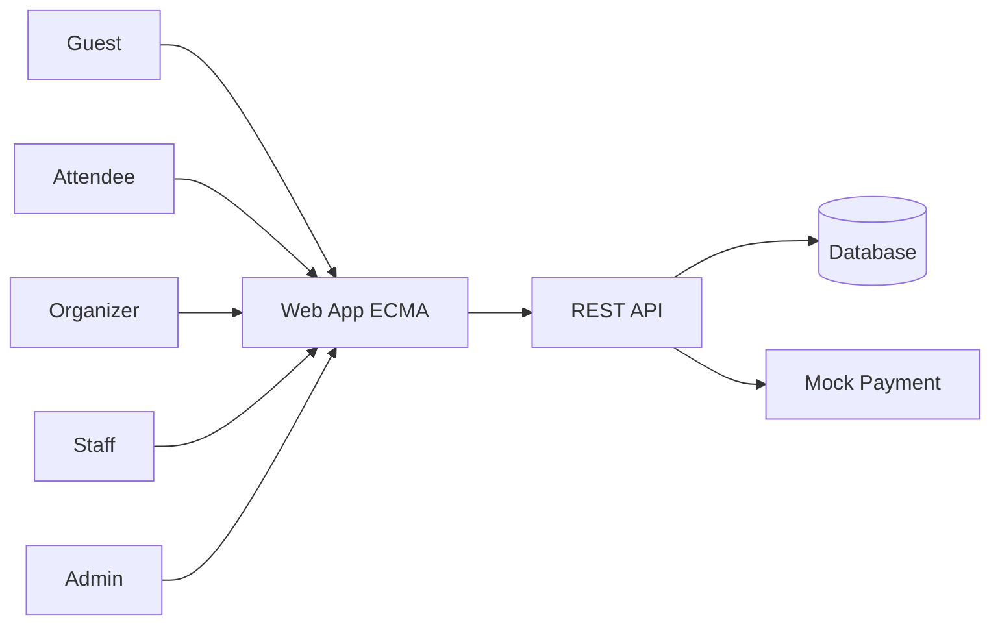
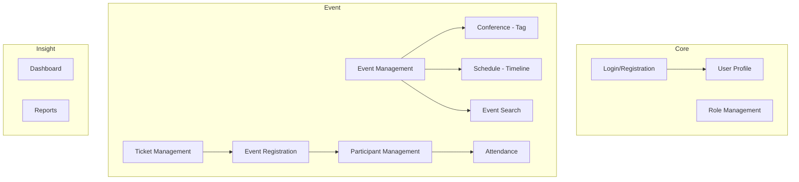
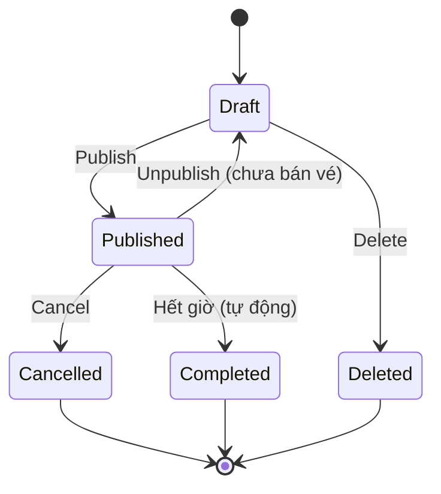
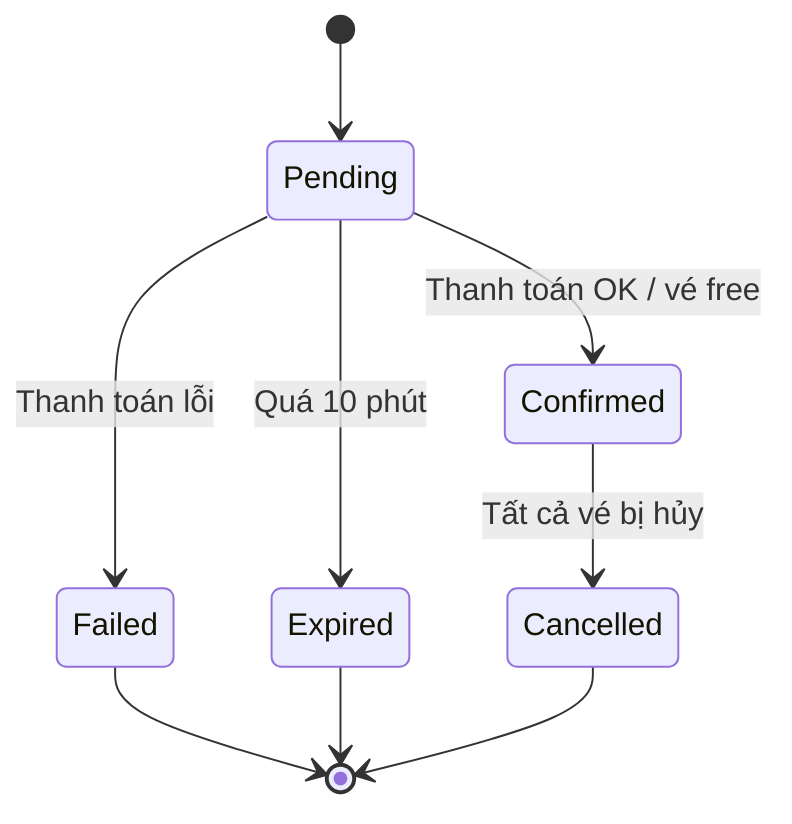
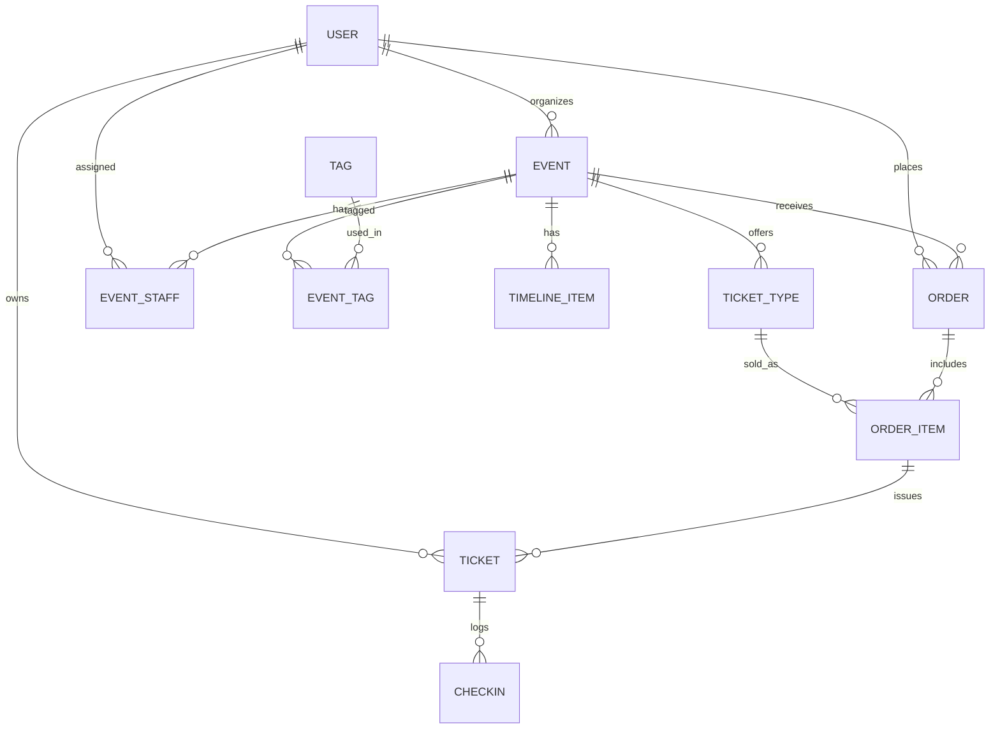

# SOFTWARE REQUIREMENTS SPECIFICATION (SRS)

## Events and Conferences Management Application (ECMA)

| Thông tin           | Nội dung                                                           |
|---------------------|--------------------------------------------------------------------|
| Tên dự án           | Events and Conferences Management Application (ECMA)               |
| Phiên bản tài liệu  | 1.0                                                                |
| Loại ứng dụng       | Web application (chạy trên trình duyệt desktop)                    |
| Mục đích sử dụng    | Đồ án môn Kiểm chứng phần mềm (Software Verification & Validation) |
| Ứng dụng tham chiếu | Eventbrite                                                         |

## 1. Giới thiệu

### 1.1 Mục đích
Tài liệu mô tả yêu cầu chức năng và phi chức năng của ứng dụng **ECMA** – ứng dụng web để tổ chức, đăng ký tham gia và quản lý sự kiện/hội nghị. Tài liệu là cơ sở để:
- Phát triển ứng dụng ở mức tối thiểu vừa đủ để vận hành.
- Thiết kế test case và truy vết yêu cầu (black-box, boundary value, equivalence partitioning, state transition, decision table…).

### 1.2 Phạm vi
ECMA là ứng dụng web cho phép:
- **Người tham dự (Attendee):** tìm kiếm sự kiện, đăng ký/mua vé, xem lịch của mình.
- **Ban tổ chức (Organizer):** tạo và quản lý sự kiện, timeline, vé, người tham dự, điểm danh, xem báo cáo.
- **Nhân viên check-in (Staff):** điểm danh người tham dự tại sự kiện.
- **Quản trị viên (Admin):** quản lý người dùng và phân quyền.

**Nguyên tắc phạm vi:**
- Thanh toán được **giả lập (mock payment)**.
- **Không có email và không có thông báo** (notification) dưới bất kỳ hình thức nào. Người dùng tự xem trạng thái vé/sự kiện trên giao diện.
- Định danh người dùng bằng **username**.

### 1.3 Định nghĩa, từ viết tắt

| Thuật ngữ     | Giải thích                                                                                   |
|---------------|----------------------------------------------------------------------------------------------|
| Event         | Sự kiện, diễn ra trong một khoảng thời gian, gồm thông tin mô tả, tag, timeline, các loại vé |
| Tag           | Nhãn phân loại của Event, chọn từ danh sách cố định. Một Event có 1–5 tag                    |
| Conference    | Event có gắn tag **"Conference"**; không có logic nghiệp vụ riêng                            |
| Timeline      | Danh sách các mục chương trình của một Event, xếp theo thời gian                             |
| Timeline Item | Một mục trong timeline: tiêu đề, giờ bắt đầu, giờ kết thúc, description riêng                |
| Ticket Type   | Loại vé (Free, Standard, VIP…) của một Event                                                 |
| Order         | Đơn đăng ký/mua vé của một người dùng                                                        |
| Ticket        | Vé cá nhân được phát hành khi Order được xác nhận, có mã vé duy nhất                         |
| Check-in      | Xác nhận người tham dự có mặt tại sự kiện                                                    |
| FR / NFR / BR | Functional Requirement / Non-functional Requirement / Business Rule                          |
| VND           | Đồng Việt Nam – đơn vị tiền tệ mặc định                                                      |

### 1.4 Tài liệu tham khảo
- IEEE Std 830–1998 – Recommended Practice for Software Requirements Specifications.
- Eventbrite (https://www.eventbrite.com) – tham chiếu luồng nghiệp vụ.

### 1.5 Quy ước ưu tiên
- **M (Must):** bắt buộc có.
- **S (Should):** nên có.

> Tài liệu này không còn yêu cầu mức C (Could).

---

## 2. Mô tả tổng quan

### 2.1 Bối cảnh sản phẩm
Ứng dụng web độc lập, kiến trúc client–server (Frontend – REST API – CSDL quan hệ).

### 2.2 Nhóm người dùng

| Vai trò   | Mô tả                                              | Cách có được                                  |
|-----------|----------------------------------------------------|-----------------------------------------------|
| Guest     | Chưa đăng nhập; chỉ xem/tìm kiếm sự kiện công khai | Mặc định                                      |
| Attendee  | Người dùng đã đăng ký tài khoản                    | Đăng ký tài khoản (vai trò mặc định)          |
| Organizer | Tạo và quản lý sự kiện                             | Do Admin cấp                                  |
| Staff     | Chỉ check-in cho sự kiện được phân công            | Do Admin cấp vai trò, Organizer gán vào Event |
| Admin     | Toàn quyền hệ thống                                | Tài khoản seed sẵn                            |

### 2.3 Sơ đồ chức năng

### 2.4 Môi trường vận hành
- Trình duyệt desktop: Chrome, Firefox, Edge bản mới nhất; độ rộng màn hình tối thiểu 1024 px.
- Máy chủ: bất kỳ nền tảng nào chạy được web server + CSDL quan hệ PostgreSQL.
- Ngôn ngữ giao diện: chọn một (Tiếng Anh hoặc Tiếng Việt), nhất quán toàn ứng dụng.

### 2.5 Ràng buộc chung
- Múi giờ: **Asia/Ho_Chi_Minh (UTC+7)**; lưu DB theo UTC.
- Tiền tệ: VND, số nguyên.
- Thanh toán là giả lập; không có email/thông báo.

### 2.6 Giả định & phụ thuộc
- Đồng hồ hệ thống chính xác (ảnh hưởng đến các quy tắc theo thời gian: bán vé, hủy vé, check-in).
- Thông tin như địa điểm, diễn giả, chương trình chi tiết do Organizer tự viết trong description.

---

## 3. Yêu cầu chức năng

> **Quy ước:** mỗi mục gồm bảng yêu cầu (FR), quy tắc nghiệp vụ/ràng buộc (BR) và gợi ý kiểm thử.

### 3.1 Login / Registration (AUTH)

| ID         | Yêu cầu                                                                    | Ưu tiên |
|------------|----------------------------------------------------------------------------|---------|
| FR-AUTH-01 | Người dùng đăng ký tài khoản bằng: username, password, xác nhận password   | M       |
| FR-AUTH-02 | Đăng ký thành công: tài khoản có vai trò Attendee, trạng thái Active       | M       |
| FR-AUTH-03 | Đăng nhập bằng username + password                                         | M       |
| FR-AUTH-04 | Đăng xuất, hủy phiên làm việc                                              | M       |
| FR-AUTH-05 | Đổi password khi đã đăng nhập (nhập password cũ + password mới + xác nhận) | M       |
| FR-AUTH-06 | Tài khoản bị Admin vô hiệu hóa (Inactive) không thể đăng nhập              | M       |

**Ràng buộc dữ liệu / Business Rules**
- BR-AUTH-01: Username: 4–20 ký tự; chỉ gồm chữ cái không dấu, chữ số, dấu gạch dưới `_`; phải bắt đầu bằng chữ cái.
- BR-AUTH-02: Username **duy nhất**, không phân biệt hoa/thường (`Alice` và `alice` là một). Đăng nhập cũng không phân biệt hoa/thường ở username.
- BR-AUTH-03: Password: 8–32 ký tự, có ít nhất 1 chữ hoa, 1 chữ thường, 1 chữ số, không chứa khoảng trắng. Password **phân biệt hoa/thường**.
- BR-AUTH-04: Xác nhận password phải trùng password.
- BR-AUTH-05: Đăng nhập sai chỉ báo chung "Username hoặc password không đúng", không cho biết cái nào sai.
- BR-AUTH-06: Phiên đăng nhập hết hạn sau 30 phút không hoạt động.
- BR-AUTH-07: Password mới không được trùng password cũ.
- BR-AUTH-08: Password được lưu dưới dạng hash (bcrypt/argon2), không lưu thô.

---

### 3.2 User Profile (PROF)

| ID         | Yêu cầu                                                                      | Ưu tiên |
|------------|------------------------------------------------------------------------------|---------|
| FR-PROF-01 | Xem thông tin hồ sơ cá nhân                                                  | M       |
| FR-PROF-02 | Cập nhật: họ tên, số điện thoại, ngày sinh, giới tính, giới thiệu ngắn (bio) | M       |
| FR-PROF-03 | Upload ảnh đại diện (avatar)                                                 | S       |
| FR-PROF-04 | Username hiển thị nhưng **không cho sửa**                                    | M       |
| FR-PROF-05 | Xem lịch sử đơn đăng ký và vé của bản thân                                   | M       |

**Ràng buộc**
- BR-PROF-01: Họ tên: không bắt buộc; nếu nhập thì 2–50 ký tự (chữ cái, khoảng trắng).
- BR-PROF-02: Số điện thoại: không bắt buộc; nếu nhập thì đúng 10 chữ số, bắt đầu bằng 0.
- BR-PROF-03: Ngày sinh: không bắt buộc; không được ở tương lai; tuổi tối thiểu 13.
- BR-PROF-04: Bio tối đa 300 ký tự.
- BR-PROF-05: Avatar: JPG/PNG, tối đa 2 MB.

**Gợi ý kiểm thử:** file sai định dạng/quá dung lượng (2 MB, 2 MB + 1 byte); ngày sinh hôm nay/ngày mai/đúng 13 tuổi và thiếu 1 ngày; số điện thoại 9/10/11 chữ số; bỏ trống các trường không bắt buộc.

---

### 3.3 Event Management (EVT)

Người có quyền: Organizer (Event của mình), Admin (tất cả).

| ID        | Yêu cầu                                                                                       | Ưu tiên |
|-----------|-----------------------------------------------------------------------------------------------|---------|
| FR-EVT-01 | Tạo Event với: tiêu đề, description, tag (1–5), thời gian bắt đầu/kết thúc, sức chứa          | M       |
| FR-EVT-02 | Event mới tạo có trạng thái **Draft**                                                         | M       |
| FR-EVT-03 | Chỉnh sửa Event (Draft: tự do; Published: theo BR-EVT-06)                                     | M       |
| FR-EVT-04 | **Publish** Event: Draft → Published, hiển thị công khai                                      | M       |
| FR-EVT-05 | **Unpublish** Event chưa có vé nào được bán: Published → Draft                                | S       |
| FR-EVT-06 | **Cancel** Event: Published → Cancelled; tự động hủy các vé còn hiệu lực, hoàn tiền giả lập   | M       |
| FR-EVT-07 | Xóa Event ở trạng thái Draft (xóa mềm)                                                        | M       |
| FR-EVT-08 | Xem danh sách Event do mình tạo, lọc theo trạng thái                                          | M       |
| FR-EVT-09 | Trang chi tiết Event công khai (Guest cũng xem được): description, tag, timeline, các loại vé | M       |
| FR-EVT-10 | Tự động chuyển Published → **Completed** khi quá thời gian kết thúc                           | M       |
| FR-EVT-11 | Upload ảnh bìa cho Event                                                                      | S       |

**Trạng thái của Event**

**Ràng buộc**
- BR-EVT-01: Tiêu đề: 5–100 ký tự, bắt buộc.
- BR-EVT-02: Description: 1–3000 ký tự, bắt buộc. Organizer tự ghi địa điểm, diễn giả, thông tin liên hệ… trong description (hệ thống không lưu riêng).
- BR-EVT-03: Tag: bắt buộc chọn từ 1 đến 5 tag, lấy từ danh sách cố định (xem 3.4).
- BR-EVT-04: Thời gian bắt đầu phải **ở tương lai** (khi tạo và khi Publish); thời gian kết thúc phải **sau** thời gian bắt đầu; thời lượng tối đa 30 ngày (Event nhiều ngày được phép).
- BR-EVT-05: Sức chứa: số nguyên 1–10.000. Tổng số vé phát hành của tất cả Ticket Type **không vượt quá** sức chứa.
- BR-EVT-06: Khi Event đã Published và **đã có vé bán**: không được giảm sức chứa xuống dưới số vé đã bán. Khi đổi thời gian bắt đầu/kết thúc, các ràng buộc BR-SCH-03 (timeline nằm trong khoảng thời gian Event) và BR-TKT-05 (thời gian đóng bán ≤ giờ bắt đầu) **vẫn phải thỏa**, nếu không hệ thống từ chối lưu.
- BR-EVT-07: Chỉ được **Publish** khi Event có ít nhất 1 Ticket Type hợp lệ. Timeline **không bắt buộc** (Event có thể chưa có timeline).
- BR-EVT-08: Không thể Cancel Event đã Completed/Cancelled. Khi Cancel: mọi vé Valid chuyển Cancelled, Order chuyển Cancelled, ghi nhận hoàn tiền.
- BR-EVT-09: Organizer chỉ thao tác được trên Event do mình sở hữu.
- BR-EVT-10: Ảnh bìa: JPG/PNG, tối đa 2 MB.
- BR-EVT-11: Event Completed/Cancelled không được chỉnh sửa.

---

### 3.4 Conference Management (CONF)

Conference **không phải một loại Event riêng**. Conference là Event có gắn tag **"Conference"**. Mọi nghiệp vụ (tạo, vé, đăng ký, check-in, báo cáo…) đều dùng chung với Event.

| ID         | Yêu cầu                                                                                    | Ưu tiên |
|------------|--------------------------------------------------------------------------------------------|---------|
| FR-CONF-01 | Hệ thống có danh sách tag cố định (seed sẵn), gồm cả tag "Conference"                      | M       |
| FR-CONF-02 | Organizer gán/gỡ tag cho Event khi tạo hoặc chỉnh sửa                                      | M       |
| FR-CONF-03 | Event có tag "Conference" hiển thị nhãn (badge) "Conference" ở danh sách và trang chi tiết | M       |
| FR-CONF-04 | Menu "Conferences" là lối tắt tới trang tìm kiếm với bộ lọc tag = Conference               | S       |

**Danh sách tag cố định:** Conference, Workshop, Meetup, Networking, Music, Business, Technology, Education, Sports, Arts, Food & Drink, Health, Other.

**Ràng buộc**
- BR-CONF-01: Người dùng **không** tự tạo tag mới; chỉ chọn từ danh sách cố định.
- BR-CONF-02: Không gán trùng một tag hai lần cho cùng Event.
- BR-CONF-03: Gỡ tag được phép nhưng Event phải còn ít nhất 1 tag.
- BR-CONF-04: Tag "Conference" **không** kích hoạt thêm quy tắc nào khác so với Event thường (ví dụ: không bắt buộc có timeline).

---

### 3.5 Event Search (SRCH)

| ID         | Yêu cầu                                                                                                                                                            | Ưu tiên |
|------------|--------------------------------------------------------------------------------------------------------------------------------------------------------------------|---------|
| FR-SRCH-01 | Tìm theo từ khóa trong tiêu đề và description (không phân biệt hoa/thường). Vì địa điểm/diễn giả nằm trong description nên từ khóa cũng tìm được các thông tin này | M       |
| FR-SRCH-02 | Lọc theo tag (chọn 1 tag)                                                                                                                                          | M       |
| FR-SRCH-03 | Lọc theo khoảng ngày (từ ngày – đến ngày) theo **ngày bắt đầu** của Event                                                                                          | M       |
| FR-SRCH-04 | Lọc theo giá: Tất cả / Miễn phí / Có phí                                                                                                                           | M       |
| FR-SRCH-05 | Sắp xếp: Bắt đầu gần nhất (mặc định), Mới tạo, Giá tăng dần, Giá giảm dần                                                                                          | M       |
| FR-SRCH-06 | Phân trang: 10 kết quả/trang                                                                                                                                       | M       |
| FR-SRCH-07 | Kết hợp nhiều bộ lọc đồng thời (AND)                                                                                                                               | M       |
| FR-SRCH-08 | Hiển thị "Không tìm thấy sự kiện" khi không có kết quả                                                                                                             | M       |

**Ràng buộc**
- BR-SRCH-01: Chỉ hiển thị Event **Published** và chưa kết thúc.
- BR-SRCH-02: Event Draft/Cancelled/Completed/Deleted không xuất hiện trong kết quả.
- BR-SRCH-03: "Từ ngày" ≤ "Đến ngày"; nếu vi phạm hiển thị lỗi.
- BR-SRCH-04: Từ khóa tối đa 100 ký tự; ký tự đặc biệt/SQL được xử lý an toàn.
- BR-SRCH-05: Event hết vé (mọi Ticket Type đều hết) vẫn hiển thị với nhãn "Sold out".
- BR-SRCH-06: "Miễn phí" = tất cả Ticket Type giá 0; "Có phí" = có ít nhất một Ticket Type giá > 0. Giá dùng để sắp xếp là **giá thấp nhất** trong các Ticket Type.

---

### 3.6 Event Registration (REG)

Luồng giống Eventbrite: chọn vé → thanh toán (giả lập) → nhận vé.

| ID        | Yêu cầu                                                                                                     | Ưu tiên |
|-----------|-------------------------------------------------------------------------------------------------------------|---------|
| FR-REG-01 | Người dùng đã đăng nhập chọn Ticket Type và số lượng để đăng ký                                             | M       |
| FR-REG-02 | Guest bấm đăng ký được chuyển sang trang đăng nhập, sau đó quay lại luồng đăng ký                           | S       |
| FR-REG-03 | Vé miễn phí (tổng tiền = 0): xác nhận ngay, không qua thanh toán                                            | M       |
| FR-REG-04 | Vé có phí: chuyển sang thanh toán giả lập (người dùng chọn "Thanh toán thành công" / "Thanh toán thất bại") | M       |
| FR-REG-05 | Thanh toán thành công: Order = Confirmed, phát hành Ticket (mã vé duy nhất)                                 | M       |
| FR-REG-06 | Thanh toán thất bại: Order = Failed, vé được trả lại kho                                                    | M       |
| FR-REG-07 | Giữ chỗ 10 phút khi Order ở trạng thái Pending; quá hạn tự động Expired và trả vé                           | M       |
| FR-REG-08 | Xem danh sách "Vé của tôi" và chi tiết vé (mã vé, Event, loại vé, trạng thái)                               | M       |
| FR-REG-09 | Hủy vé theo chính sách hủy (hủy từng vé)                                                                    | M       |

**Trạng thái Order**

**Ràng buộc**
- BR-REG-01: Số lượng vé mỗi lần đặt: 1–10.
- BR-REG-02: Mỗi tài khoản tối đa **10 vé còn hiệu lực** (Valid/Used cộng vé trong Order Pending) cho cùng một Event.
- BR-REG-03: Không được đăng ký khi: Event không Published; Event đã bắt đầu; ngoài khoảng thời gian bán vé; Ticket Type ở trạng thái Paused; Ticket Type hết vé; số lượng vượt tồn kho.
- BR-REG-04: Không bán vượt tồn kho/sức chứa kể cả khi hai người đặt cùng lúc (xử lý đồng thời bằng transaction/lock).
- BR-REG-05: **Chính sách hủy:** được hủy khi còn **≥ 24 giờ** trước giờ bắt đầu Event; hoàn 100% (giả lập). Còn dưới 24 giờ: không được hủy.
- BR-REG-06: Khi hủy vé: vé chuyển Cancelled, tồn kho được trả lại. Order chuyển Cancelled khi **tất cả** vé trong Order đã Cancelled.
- BR-REG-07: Tổng tiền = Σ (đơn giá × số lượng). Không có phí dịch vụ.
- BR-REG-08: Vé thuộc về tài khoản người mua (không nhập thông tin người tham dự riêng cho từng vé).
- BR-REG-09: Organizer **không** được đăng ký Event do chính mình sở hữu.
- BR-REG-10: Vé của Event có timeline cấp quyền tham dự **toàn bộ** Event (không đăng ký riêng từng Timeline Item).

---

### 3.7 Participant Management (PART)

Dành cho Organizer (Event của mình) và Admin. Mỗi dòng trong danh sách là **một vé**.

| ID         | Yêu cầu                                                                                                                   | Ưu tiên |
|------------|---------------------------------------------------------------------------------------------------------------------------|---------|
| FR-PART-01 | Xem danh sách người tham dự của Event: username, họ tên, loại vé, mã vé, trạng thái vé, trạng thái check-in, ngày đăng ký | M       |
| FR-PART-02 | Tìm kiếm theo username/họ tên/mã vé                                                                                       | M       |
| FR-PART-03 | Lọc theo loại vé, trạng thái vé (Valid/Used/Cancelled), trạng thái check-in                                               | M       |
| FR-PART-04 | Phân trang (20 dòng/trang)                                                                                                | M       |
| FR-PART-05 | Thêm người tham dự thủ công theo username: hệ thống cấp 1 vé miễn phí                                                     | S       |
| FR-PART-06 | Hủy vé của người tham dự (kèm lý do), hoàn tiền giả lập                                                                   | M       |
| FR-PART-07 | Xuất danh sách ra file CSV                                                                                                | M       |

**Ràng buộc**
- BR-PART-01: Organizer chỉ xem/quản lý người tham dự của Event mình sở hữu.
- BR-PART-02: Không được thêm thủ công khi Event đã đủ sức chứa hoặc username không tồn tại/Inactive.
- BR-PART-03: Không hủy được vé đã check-in (trạng thái Used).
- BR-PART-04: Lý do hủy: bắt buộc, 1–200 ký tự.
- BR-PART-05: CSV có header cố định, mã hóa UTF-8, dữ liệu khớp danh sách đang lọc.
- BR-PART-06: Vé thêm thủ công tính vào sức chứa và tồn kho Ticket Type được chọn.

---

### 3.8 Schedule Management – Timeline (SCH)

Mỗi Event có một **timeline** gồm nhiều Timeline Item, **mỗi mục có description riêng**. Ví dụ (Conference 1 ngày):

| Giờ         | Tiêu đề             | Description                                      |
|-------------|---------------------|--------------------------------------------------|
| 08:00–09:00 | Đăng ký & đón khách | Nhận thẻ tại sảnh A                              |
| 09:00–10:30 | Keynote             | Diễn giả: Nguyễn Văn A – Xu hướng công nghệ 2026 |
| 10:30–10:45 | Giải lao            | Tea break                                        |

| ID        | Yêu cầu                                                                                                                               | Ưu tiên |
|-----------|---------------------------------------------------------------------------------------------------------------------------------------|---------|
| FR-SCH-01 | Organizer thêm Timeline Item vào Event: tiêu đề, giờ bắt đầu, giờ kết thúc, description                                               | M       |
| FR-SCH-02 | Sửa Timeline Item                                                                                                                     | M       |
| FR-SCH-03 | Xóa Timeline Item                                                                                                                     | M       |
| FR-SCH-04 | Hệ thống từ chối lưu khi Timeline Item **chồng lấn thời gian** với mục khác của cùng Event                                            | M       |
| FR-SCH-05 | Xem timeline trên trang chi tiết Event, sắp xếp theo giờ bắt đầu, nhóm theo ngày (với Event nhiều ngày), mỗi mục hiển thị description | M       |
| FR-SCH-06 | Attendee xem "Lịch của tôi": danh sách Event mình đang có vé hợp lệ, sắp xếp theo thời gian bắt đầu; xem được timeline từng Event     | S       |

**Ràng buộc**
- BR-SCH-01: Tiêu đề Timeline Item: 3–100 ký tự, bắt buộc. Description: 0–1000 ký tự (không bắt buộc).
- BR-SCH-02: Giờ bắt đầu < giờ kết thúc; thời lượng tối thiểu 5 phút.
- BR-SCH-03: Timeline Item phải nằm **trong** khoảng thời gian của Event (bắt đầu ≥ giờ bắt đầu Event, kết thúc ≤ giờ kết thúc Event).
- BR-SCH-04: Các Timeline Item của cùng một Event **không được giao nhau** về thời gian. Chạm biên (mục A kết thúc 10:00, mục B bắt đầu 10:00) **được phép**. Nội dung song song (nhiều phòng, nhiều track) nếu có thì mô tả trong description.
- BR-SCH-05: Tối đa 50 Timeline Item cho mỗi Event.
- BR-SCH-06: Chỉ Organizer sở hữu Event (hoặc Admin) được thêm/sửa/xóa; không sửa được khi Event Completed/Cancelled.
- BR-SCH-07: Có thể thêm timeline khi Event còn Draft hoặc đã Published.
- BR-SCH-08: "Lịch của tôi" chỉ gồm Event mà người dùng có ít nhất một vé Valid/Used, Event chưa Cancelled.

---

### 3.9 Ticket Management (TKT)

| ID        | Yêu cầu                                                                                              | Ưu tiên |
|-----------|------------------------------------------------------------------------------------------------------|---------|
| FR-TKT-01 | Organizer tạo Ticket Type: tên, giá, số lượng phát hành, thời gian mở/đóng bán, số vé tối đa mỗi đơn | M       |
| FR-TKT-02 | Sửa Ticket Type (theo BR-TKT-04)                                                                     | M       |
| FR-TKT-03 | Xóa Ticket Type chưa bán vé nào                                                                      | M       |
| FR-TKT-04 | Tạm dừng/mở bán lại Ticket Type (Active/Paused)                                                      | S       |
| FR-TKT-05 | Xem thống kê từng Ticket Type: tổng số, đã bán, còn lại, doanh thu                                   | M       |
| FR-TKT-06 | Mỗi vé phát hành có **mã vé duy nhất** (định dạng `TKT-` + 8 ký tự chữ hoa/số)                       | M       |

**Ràng buộc**
- BR-TKT-01: Tên loại vé: 2–50 ký tự, duy nhất trong cùng Event.
- BR-TKT-02: Giá: số nguyên 0–100.000.000 VND; giá 0 = vé miễn phí.
- BR-TKT-03: Số lượng phát hành ≥ 1; tổng số lượng các loại vé ≤ sức chứa Event.
- BR-TKT-04: Khi đã có vé bán: **không** được sửa giá; số lượng phát hành mới không được nhỏ hơn số đã bán.
- BR-TKT-05: Thời gian mở bán < thời gian đóng bán ≤ thời gian bắt đầu Event.
- BR-TKT-06: Số vé tối đa mỗi đơn: 1–10 (mặc định 10).
- BR-TKT-07: Mã vé duy nhất toàn hệ thống, ngẫu nhiên (không tăng dần).
- BR-TKT-08: Vé Cancelled hoặc Used không thể chuyển sang trạng thái khác (trừ hoàn tác check-in: Used → Valid).
- BR-TKT-09: Doanh thu của Ticket Type = Σ đơn giá các vé ở trạng thái Valid/Used.

**Trạng thái vé phát hành:** `Valid` → `Used` (check-in) | `Valid` → `Cancelled`; `Used` → `Valid` (chỉ khi hoàn tác check-in).

---

### 3.10 Attendance (ATT)

| ID        | Yêu cầu                                                                                      | Ưu tiên |
|-----------|----------------------------------------------------------------------------------------------|---------|
| FR-ATT-01 | Staff/Organizer check-in bằng cách **nhập mã vé**                                            | M       |
| FR-ATT-02 | Hệ thống hiển thị kết quả: **Thành công** (kèm username, loại vé) hoặc **Từ chối** kèm lý do | M       |
| FR-ATT-03 | Ghi nhận thời điểm check-in và người thực hiện                                               | M       |
| FR-ATT-04 | Check-in thủ công bằng cách chọn từ danh sách người tham dự                                  | S       |
| FR-ATT-05 | Hoàn tác check-in (Organizer/Admin)                                                          | S       |
| FR-ATT-06 | Xem thống kê: số đã check-in / tổng vé Valid+Used / tỷ lệ %                                  | M       |

**Ràng buộc**
- BR-ATT-01: Chỉ check-in được khi: vé `Valid`, thuộc **đúng Event**, Event đang Published, và trong **cửa sổ check-in** từ 2 giờ trước giờ bắt đầu đến giờ kết thúc Event.
- BR-ATT-02: Vé đã check-in không check-in lần hai (báo "Đã sử dụng lúc hh:mm").
- BR-ATT-03: Vé Cancelled/không tồn tại/thuộc Event khác bị từ chối với thông báo tương ứng.
- BR-ATT-04: Chỉ Staff được gán cho Event đó, Organizer sở hữu Event, hoặc Admin mới check-in được.
- BR-ATT-05: Tỷ lệ tham dự = số vé Used / (số vé Valid + Used) × 100%, làm tròn 1 chữ số thập phân; mẫu số = 0 thì hiển thị 0%.
- BR-ATT-06: Hoàn tác check-in đưa vé về Valid và ghi nhận lại thao tác hoàn tác.

---

### 3.11 Dashboard (DASH)

| ID         | Yêu cầu                                                                                                                                                   | Vai trò   | Ưu tiên |
|------------|-----------------------------------------------------------------------------------------------------------------------------------------------------------|-----------|---------|
| FR-DASH-01 | Hiển thị các Event sắp tới đã có vé, vé gần đây, gợi ý các Event sắp diễn ra                                                                              | Attendee  | M       |
| FR-DASH-02 | Hiển thị số Event của mình theo trạng thái, số vé đã bán, doanh thu, số người đã check-in, Event sắp diễn ra; biểu đồ vé bán theo ngày (30 ngày gần nhất) | Organizer | M       |
| FR-DASH-03 | Hiển thị các Event được gán hôm nay và nút vào màn hình check-in                                                                                          | Staff     | S       |
| FR-DASH-04 | Hiển thị tổng người dùng (theo vai trò), tổng Event (theo trạng thái), tổng doanh thu, Top 5 Event bán chạy, người dùng mới 7 ngày gần nhất               | Admin     | M       |

**Ràng buộc**
- BR-DASH-01: Số liệu Dashboard khớp với Reports cùng điều kiện.
- BR-DASH-02: Doanh thu = Σ đơn giá các vé Valid/Used (không tính vé Cancelled).
- BR-DASH-03: Organizer chỉ thấy dữ liệu của mình.
- BR-DASH-04: Chưa có dữ liệu thì hiển thị 0 hoặc "Chưa có dữ liệu", không lỗi.

---

### 3.12 Reports (RPT)

| ID        | Yêu cầu                                                                                                | Vai trò          | Ưu tiên |
|-----------|--------------------------------------------------------------------------------------------------------|------------------|---------|
| FR-RPT-01 | **Báo cáo bán vé** theo Event: số vé bán theo loại vé, theo ngày                                       | Organizer, Admin | M       |
| FR-RPT-02 | **Báo cáo doanh thu**: theo Event, theo khoảng thời gian; tổng doanh thu, theo loại vé, tổng tiền hoàn | Organizer, Admin | M       |
| FR-RPT-03 | **Báo cáo tham dự**: số đăng ký, số check-in, tỷ lệ tham dự, vắng mặt (no-show)                        | Organizer, Admin | M       |
| FR-RPT-04 | **Báo cáo người dùng**: đăng ký mới theo thời gian, theo vai trò                                       | Admin            | S       |
| FR-RPT-05 | Bộ lọc: khoảng thời gian, Event, tag                                                                   | Các báo cáo      | M       |
| FR-RPT-06 | Xuất báo cáo ra CSV                                                                                    | Các báo cáo      | M       |

**Ràng buộc**
- BR-RPT-01: "Từ ngày" ≤ "Đến ngày"; khoảng tối đa 366 ngày.
- BR-RPT-02: Organizer chỉ xem báo cáo của Event mình sở hữu.
- BR-RPT-03: Doanh thu = Σ đơn giá vé Valid/Used; Tiền hoàn = Σ đơn giá vé Cancelled; No-show = số vé Valid còn lại (chưa check-in) của Event đã Completed.
- BR-RPT-04: Dữ liệu CSV trùng với dữ liệu hiển thị (UTF-8, header cố định).
- BR-RPT-05: Báo cáo rỗng hiển thị "Không có dữ liệu"; CSV chỉ có header.

---

### 3.13 Role Management (ROLE)

| ID         | Yêu cầu                                                                                                                             | Ưu tiên |
|------------|-------------------------------------------------------------------------------------------------------------------------------------|---------|
| FR-ROLE-01 | Admin xem danh sách người dùng: username, vai trò, trạng thái, ngày tạo; tìm theo username; lọc theo vai trò/trạng thái; phân trang | M       |
| FR-ROLE-02 | Admin đổi vai trò người dùng (Attendee, Organizer, Staff, Admin)                                                                    | M       |
| FR-ROLE-03 | Admin kích hoạt/vô hiệu hóa tài khoản                                                                                               | M       |
| FR-ROLE-04 | Organizer gán/gỡ Staff cho Event của mình (theo username)                                                                           | S       |
| FR-ROLE-05 | Kiểm soát truy cập (RBAC) theo ma trận phân quyền mục 3.13.1 cho mọi trang và API                                                   | M       |

**Ràng buộc**
- BR-ROLE-01: Mỗi người dùng có **một** vai trò.
- BR-ROLE-02: Hệ thống luôn còn ít nhất **1 Admin Active**; Admin không thể tự hạ vai trò/vô hiệu hóa mình nếu là Admin cuối cùng.
- BR-ROLE-03: Không được đổi vai trò/vô hiệu hóa một Organizer đang có Event Published chưa kết thúc (hệ thống báo lỗi).
- BR-ROLE-04: Thay đổi vai trò có hiệu lực ngay ở request tiếp theo.
- BR-ROLE-05: Truy cập trái quyền trả về HTTP **403**; chưa đăng nhập trả về **401** (hoặc chuyển hướng trang đăng nhập).
- BR-ROLE-06: Chỉ gán được Staff là người dùng có vai trò Staff; một Staff có thể được gán cho nhiều Event.
- BR-ROLE-07: Tài khoản bị vô hiệu hóa mất hiệu lực đăng nhập ngay, kể cả phiên đang mở.

#### 3.13.1 Ma trận phân quyền

| Chức năng                     | Guest | Attendee |          Staff           |       Organizer        |   Admin    |
|-------------------------------|:-----:|:--------:|:------------------------:|:----------------------:|:----------:|
| Xem/tìm kiếm Event công khai  |   ✔   |    ✔     |            ✔             |           ✔            |     ✔      |
| Đăng ký tài khoản / Đăng nhập |   ✔   |    –     |            –             |           –            |     –      |
| Quản lý hồ sơ cá nhân         |   ✘   |    ✔     |            ✔             |           ✔            |     ✔      |
| Đăng ký/mua/hủy vé            |   ✘   |    ✔     |            ✔             | ✔ (trừ Event của mình) |     ✔      |
| Xem "Lịch của tôi"            |   ✘   |    ✔     |            ✔             |           ✔            |     ✔      |
| Tạo/sửa/xóa Event, gán tag    |   ✘   |    ✘     |            ✘             |      ✔ (của mình)      | ✔ (tất cả) |
| Quản lý Timeline              |   ✘   |    ✘     |            ✘             |      ✔ (của mình)      |     ✔      |
| Quản lý Ticket Type           |   ✘   |    ✘     |            ✘             |      ✔ (của mình)      |     ✔      |
| Quản lý người tham dự         |   ✘   |    ✘     | Chỉ xem (Event được gán) |      ✔ (của mình)      |     ✔      |
| Check-in                      |   ✘   |    ✘     |    ✔ (Event được gán)    |      ✔ (của mình)      |     ✔      |
| Dashboard                     |   ✘   |    ✔     |            ✔             |           ✔            |     ✔      |
| Reports                       |   ✘   |    ✘     |            ✘             |      ✔ (của mình)      | ✔ (tất cả) |
| Quản lý người dùng & vai trò  |   ✘   |    ✘     |            ✘             |           ✘            |     ✔      |

---

## 4. Yêu cầu giao diện ngoài

### 4.1 Danh sách màn hình

| #  | Màn hình                                                    | Vai trò          |
|----|-------------------------------------------------------------|------------------|
| 1  | Trang chủ (Event nổi bật + ô tìm kiếm + menu Conferences)   | Tất cả           |
| 2  | Kết quả tìm kiếm (bộ lọc + phân trang)                      | Tất cả           |
| 3  | Chi tiết Event (description, tag, timeline, các loại vé)    | Tất cả           |
| 4  | Đăng ký / Đăng nhập                                         | Guest            |
| 5  | Hồ sơ cá nhân, đổi password                                 | Đã đăng nhập     |
| 6  | Chọn vé → Thanh toán giả lập → Xác nhận                     | Attendee         |
| 7  | Vé của tôi / Chi tiết vé                                    | Attendee         |
| 8  | Lịch của tôi                                                | Attendee         |
| 9  | Dashboard (theo vai trò)                                    | Đã đăng nhập     |
| 10 | Danh sách Event của tôi / Form tạo-sửa Event (gồm chọn tag) | Organizer        |
| 11 | Quản lý Timeline của Event                                  | Organizer        |
| 12 | Quản lý Ticket Type                                         | Organizer        |
| 13 | Danh sách người tham dự                                     | Organizer        |
| 14 | Màn hình Check-in                                           | Staff, Organizer |
| 15 | Báo cáo                                                     | Organizer, Admin |
| 16 | Quản lý người dùng & vai trò                                | Admin            |

### 4.2 Yêu cầu chung cho giao diện
- Mỗi trường nhập hiển thị lỗi validate rõ ràng, gần trường lỗi; trường bắt buộc đánh dấu `*`.
- Có hộp thoại xác nhận trước thao tác nguy hiểm: Cancel Event, Hủy vé, Xóa, Vô hiệu hóa tài khoản.
- Hiển thị thông báo thành công/thất bại **ngay trên trang** sau mỗi thao tác (đây không phải chức năng Notification).

### 4.3 Giao diện API (gợi ý, để test API)
REST API dạng JSON, xác thực bằng token/session.

| Nhóm           | Endpoint mẫu                                                                                                                                                                                                                  |
|----------------|-------------------------------------------------------------------------------------------------------------------------------------------------------------------------------------------------------------------------------|
| Auth           | `POST /api/auth/register`, `POST /api/auth/login`, `POST /api/auth/logout`, `PUT /api/auth/password`                                                                                                                          |
| Profile        | `GET/PUT /api/users/me`                                                                                                                                                                                                       |
| Tags           | `GET /api/tags`                                                                                                                                                                                                               |
| Events         | `GET /api/events` (search), `GET /api/events/{id}`, `POST /api/events`, `PUT /api/events/{id}`, `DELETE /api/events/{id}`, `POST /api/events/{id}/publish`, `POST /api/events/{id}/unpublish`, `POST /api/events/{id}/cancel` |
| Timeline       | `GET/POST /api/events/{id}/timeline`, `PUT/DELETE /api/timeline-items/{id}`                                                                                                                                                   |
| Ticket Types   | `GET/POST /api/events/{id}/ticket-types`, `PUT/DELETE /api/ticket-types/{id}`                                                                                                                                                 |
| Orders/Tickets | `POST /api/orders`, `POST /api/orders/{id}/pay`, `GET /api/me/tickets`, `POST /api/tickets/{id}/cancel`                                                                                                                       |
| Participants   | `GET/POST /api/events/{id}/participants`, `GET /api/events/{id}/participants/export`                                                                                                                                          |
| Check-in       | `POST /api/checkin`, `POST /api/checkin/{ticketId}/undo`                                                                                                                                                                      |
| Reports        | `GET /api/reports/{type}`                                                                                                                                                                                                     |
| Users          | `GET /api/users`, `PUT /api/users/{id}/role`, `PUT /api/users/{id}/status`                                                                                                                                                    |
| Staff          | `GET/POST/DELETE /api/events/{id}/staff`                                                                                                                                                                                      |

Mã lỗi HTTP: 200/201 thành công, 400 dữ liệu không hợp lệ, 401 chưa xác thực, 403 không đủ quyền, 404 không tìm thấy, 409 xung đột (trùng/hết vé/chồng lấn timeline), 422 vi phạm quy tắc nghiệp vụ.

---

## 5. Yêu cầu phi chức năng

| ID     | Nhóm              | Yêu cầu                                                                                                                 |
|--------|-------------------|-------------------------------------------------------------------------------------------------------------------------|
| NFR-01 | Hiệu năng         | Trang danh sách/tìm kiếm phản hồi ≤ 3 giây với ≥ 1.000 Event và ≥ 10.000 vé                                             |
| NFR-02 | Hiệu năng         | Xử lý 50 người dùng đồng thời không lỗi                                                                                 |
| NFR-03 | Bảo mật           | Password được hash; không lưu/hiển thị password thô                                                                     |
| NFR-04 | Bảo mật           | Chống SQL Injection, XSS; escape mọi dữ liệu người dùng nhập (đặc biệt description Event và Timeline Item) khi hiển thị |
| NFR-05 | Bảo mật           | Kiểm tra quyền ở **phía server** cho mọi API, không chỉ ẩn nút trên giao diện                                           |
| NFR-06 | Bảo mật           | Token/session hết hạn theo BR-AUTH-06                                                                                   |
| NFR-07 | Toàn vẹn dữ liệu  | Không bán vượt tồn kho khi truy cập đồng thời (BR-REG-04)                                                               |
| NFR-08 | Toàn vẹn dữ liệu  | Thao tác nhiều bước (tạo Order + Ticket + cập nhật tồn kho) chạy trong một transaction                                  |
| NFR-09 | Khả dụng          | Tương thích Chrome/Firefox/Edge trên desktop, độ rộng ≥ 1024 px                                                         |
| NFR-10 | Khả dụng          | Thông báo lỗi dễ hiểu, không lộ thông tin kỹ thuật (stack trace)                                                        |
| NFR-11 | Độ tin cậy        | Job nền (hết hạn Order Pending, tự động chuyển Completed) chạy mỗi phút và **idempotent**                               |
| NFR-12 | Khả năng kiểm thử | Có script/seed dữ liệu mẫu và cách đặt lại CSDL về trạng thái ban đầu                                                   |
| NFR-13 | Khả năng kiểm thử | Có cách giả lập thời gian hiện tại (cấu hình hoặc tham số) để test các quy tắc theo thời gian                           |
| NFR-14 | Bảo trì           | Ghi log lỗi và log thao tác quan trọng (đăng nhập, đổi vai trò, Cancel Event)                                           |
| NFR-15 | Địa phương hóa    | Hỗ trợ Unicode/tiếng Việt có dấu ở mọi trường văn bản (trừ username)                                                    |

---

## 6. Mô hình dữ liệu

### 6.1 Sơ đồ thực thể – quan hệ (ERD)

### 6.2 Các thực thể chính và thuộc tính

| Thực thể         | Thuộc tính chính                                                                                                                                                                         |
|------------------|------------------------------------------------------------------------------------------------------------------------------------------------------------------------------------------|
| **User**         | id, username (unique, lưu chữ thường), password_hash, role (ATTENDEE/ORGANIZER/STAFF/ADMIN), status (ACTIVE/INACTIVE), full_name, phone, birth_date, gender, bio, avatar_url, created_at |
| **Event**        | id, organizer_id, title, description, start_time, end_time, capacity, cover_url, status (DRAFT/PUBLISHED/CANCELLED/COMPLETED/DELETED), created_at                                        |
| **Tag**          | id, name (unique) – dữ liệu seed cố định                                                                                                                                                 |
| **EventTag**     | event_id, tag_id                                                                                                                                                                         |
| **TimelineItem** | id, event_id, title, start_time, end_time, description                                                                                                                                   |
| **TicketType**   | id, event_id, name, price, quantity, sold, sale_start, sale_end, max_per_order, status (ACTIVE/PAUSED)                                                                                   |
| **Order**        | id, user_id, event_id, total_amount, status (PENDING/CONFIRMED/FAILED/EXPIRED/CANCELLED), hold_expires_at, created_at                                                                    |
| **OrderItem**    | id, order_id, ticket_type_id, unit_price, quantity                                                                                                                                       |
| **Ticket**       | id, order_item_id, owner_id, code (unique), status (VALID/USED/CANCELLED), cancel_reason, cancelled_at                                                                                   |
| **Checkin**      | id, ticket_id, checked_by, checked_at, is_undone                                                                                                                                         |
| **EventStaff**   | event_id, user_id                                                                                                                                                                        |

---

## 7. Dữ liệu seed đề xuất cho kiểm thử

| Loại        | Nội dung                                                                                                                                         |
|-------------|--------------------------------------------------------------------------------------------------------------------------------------------------|
| Tài khoản   | 1 Admin, 2 Organizer (A, B), 2 Staff, 5 Attendee, 1 tài khoản Inactive                                                                           |
| Tag         | 13 tag cố định ở mục 3.4                                                                                                                         |
| Event       | ≥ 1 Draft, ≥ 3 Published (có phí/miễn phí, có/không tag Conference, nhiều tag), 1 Cancelled, 1 Completed, 1 Event nhiều ngày có timeline ≥ 5 mục |
| Ticket Type | 1 loại vé đã **hết** (sold out), 1 chưa mở bán, 1 đã đóng bán, 1 Paused                                                                          |
| Order       | Đủ các trạng thái Pending/Confirmed/Failed/Expired/Cancelled                                                                                     |
| Ticket      | Valid, Used, Cancelled                                                                                                                           |

---

## 8. Ma trận truy vết yêu cầu → kỹ thuật kiểm thử

| Module     | Kỹ thuật kiểm thử chủ đạo                                                                                                         |
|------------|-----------------------------------------------------------------------------------------------------------------------------------|
| AUTH, PROF | Equivalence Partitioning, Boundary Value Analysis (độ dài, định dạng), Negative testing                                           |
| EVT, CONF  | State Transition (trạng thái Event), Boundary Value (thời gian, sức chứa, số tag), Authorization                                  |
| SRCH       | Pairwise/Combinatorial (tổ hợp bộ lọc), Boundary (phân trang), Injection                                                          |
| REG, TKT   | State Transition (Order/Ticket), Decision Table (điều kiện được phép đăng ký), Concurrency, Boundary (số lượng, giá, 10 vé/Event) |
| PART, RPT  | Data consistency (đối chiếu số liệu), Export validation, Authorization                                                            |
| SCH        | Boundary (chồng lấn, chạm biên, nằm trong Event), Conflict detection                                                              |
| ATT        | Decision Table (vé × Event × cửa sổ thời gian × quyền), Duplicate testing                                                         |
| DASH       | Đối chiếu số liệu với Reports/DB, Empty state                                                                                     |
| ROLE       | RBAC matrix testing, Privilege escalation, Last-admin rule                                                                        |

---

## 9. Ngoài phạm vi (Out of Scope)

- Feedback/đánh giá; Notification và email dưới mọi hình thức; Quên mật khẩu, khóa tài khoản, xác thực 2 lớp, đăng nhập mạng xã hội.
- Tích hợp cổng thanh toán thật, hóa đơn, phí nền tảng, thuế.
- Ứng dụng mobile native và giao diện responsive cho mobile.
- Quản lý riêng Speaker, Room, Track, Session, địa điểm/bản đồ (nằm trong description).
- Mã QR/quét QR, waitlist, mã giảm giá, nhân bản Event, audit log, điểm danh theo từng Timeline Item.
- Tối ưu hiệu năng/quy mô lớn, high availability.